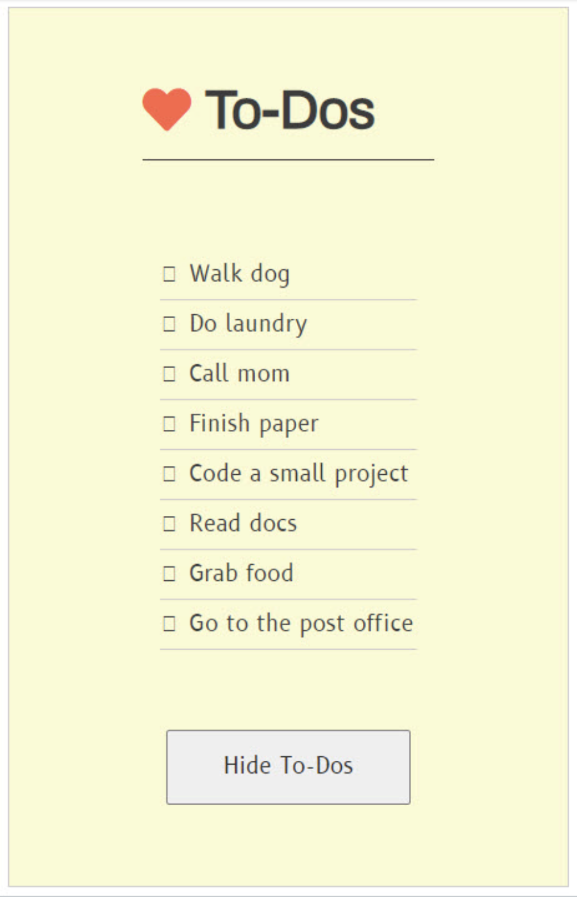

<h1>To-Do List Generator</h1>

<h2>Objective:</h2>

Program organizes to-do list elements for reviewing and checking off.

<h4>JavaScript Toolbox:</h4>

* querySelector()
* Arrays
* Function Expressions
* Event Listeners
* Event Handlers
* innerText
* innerHTML
* Debugging 

After debugging the code, the Show Me button is clicked to display the to-do list.

